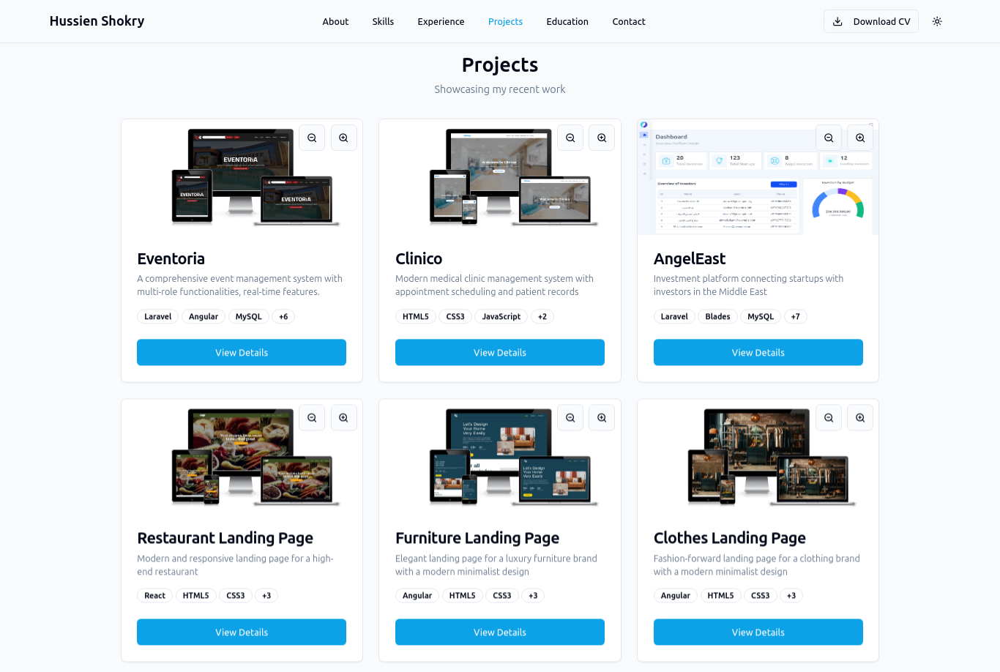
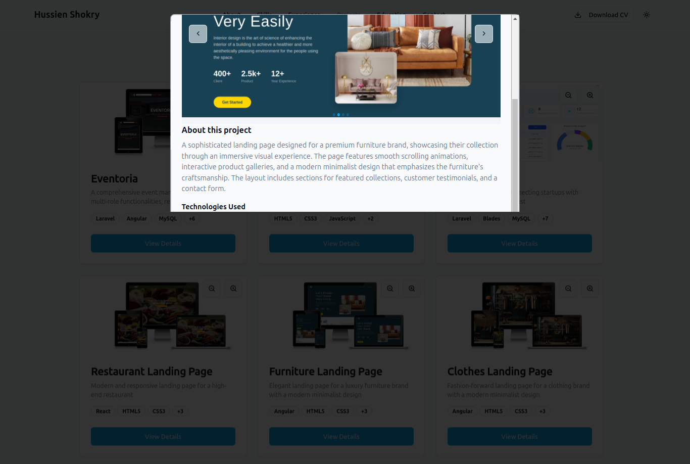
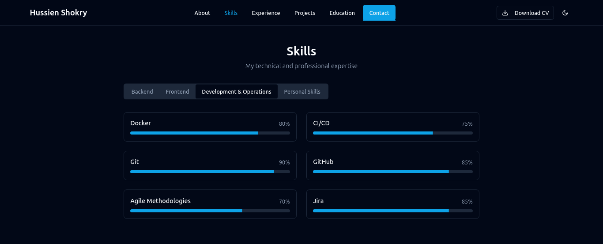
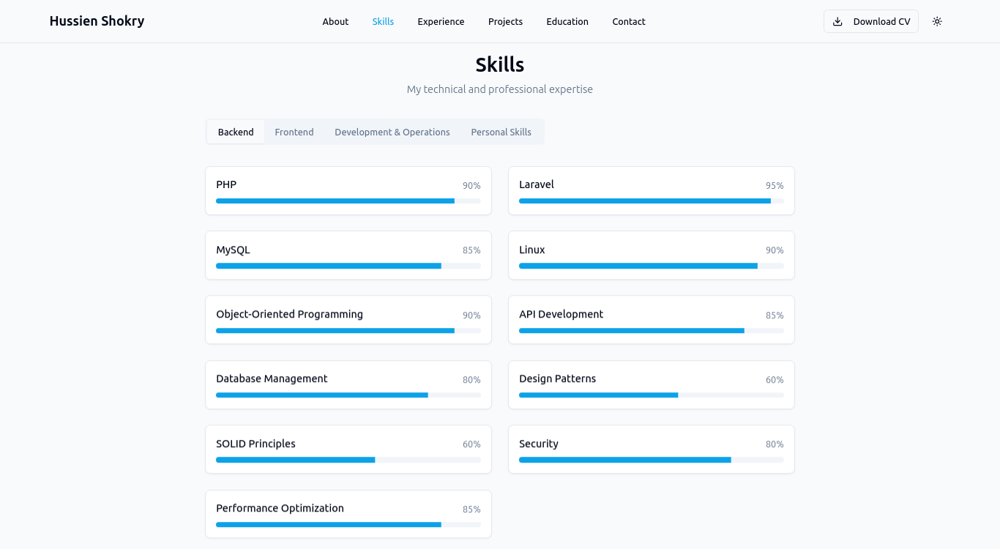
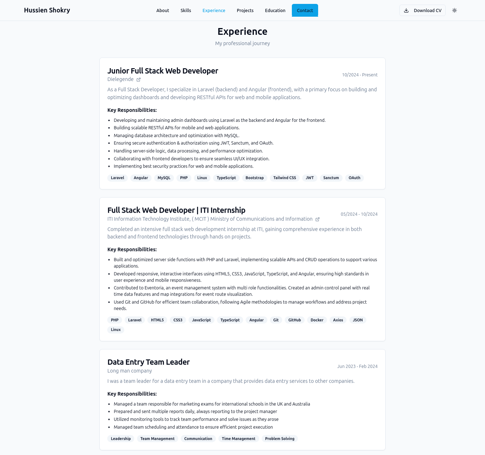
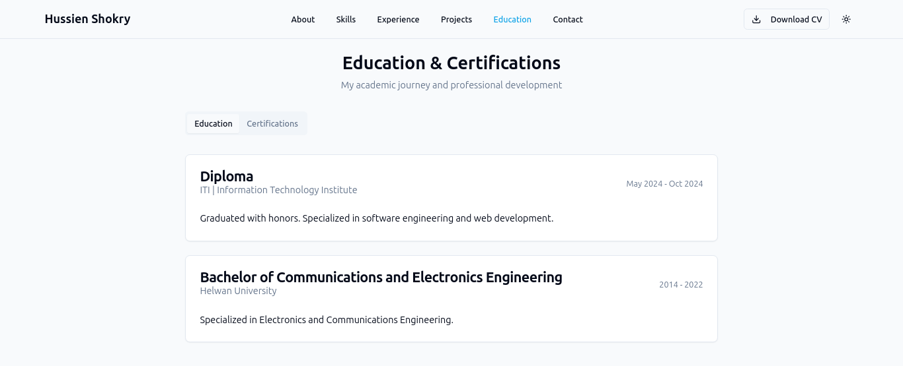
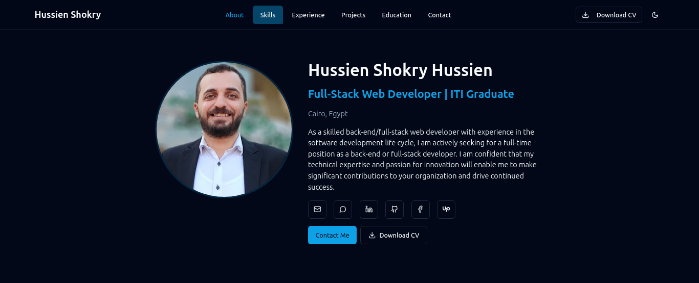
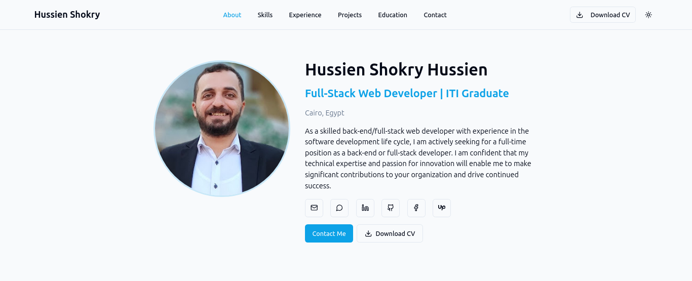
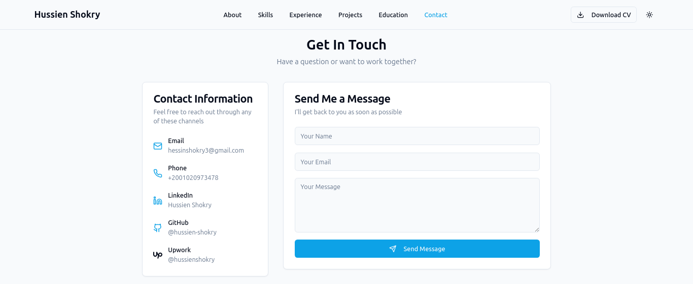

# Modern Portfolio Website

A modern, responsive portfolio website built with React, TypeScript, and Tailwind CSS. Features a clean design with dark/light mode support, image zoom capabilities, and smooth animations.

## 🌟 Features

### 1. Project Showcase

- Interactive project cards with zoom functionality
- Detailed project modal with image slider
- Technology stack badges
- Links to live demos and repositories

### 2. Image Viewing Experience

- Advanced image zoom controls (up to 10x)
- Pan and scroll functionality
- Thumbnail preview support
- Image navigation with dot indicators

### 3. Skills & Expertise


- Categorized skill display
- Progress indicators
- Clean, organized layout
- Dark/Light mode support

### 4. Professional Experience

- Detailed work history
- Company information
- Key responsibilities
- Technology stack used

### 5. Education & Background

- Academic qualifications
- Certifications
- Timeline display

### 6. About Section


- Personal introduction
- Professional summary
- Key highlights

### 7. Contact Information

- Contact form
- Social media links
- Professional networks
- Direct contact options

## 🛠 Quick Setup

1. Clone the repository:
```bash
git clone https://github.com/hessin2010king/Hussien-Portfolio.git
cd portfolio-website
```

2. Install dependencies:
```bash
npm install
```

3. Run the development server:
```bash
npm run dev
```

## 📝 Customization Guide

The portfolio is easily customizable through the `src/data/portfolio-data.ts` file. Here's how to customize each section:

### 1. Personal Information
```typescript
export const personalInfo = {
  name: "Your Name",
  title: "Your Title",
  location: "Your Location",
  email: "your.email@example.com",
  phone: "your-phone-number",
  objectiveStatement: "Your professional summary..."
};
```

### 2. Skills
```typescript
export const skills: Skill[] = [
  {
    name: "Skill Name",
    level: 90, // 0-100
    category: "Backend" // Categories: "Backend", "Frontend", "Development & Operations", "Personal Skills"
  },
  // Add more skills...
];
```

### 3. Experience
```typescript
export const experiences: Experience[] = [
  {
    company: "Company Name",
    position: "Your Position",
    duration: "Start Date - End Date",
    description: "Role description",
    responsibilities: ["Responsibility 1", "Responsibility 2"],
    website: "company-website.com",
    technologies: ["Tech1", "Tech2"]
  },
  // Add more experiences...
];
```

### 4. Projects
```typescript
export const projects: Project[] = [
  {
    id: 1,
    name: "Project Name",
    description: "Short description",
    longDescription: "Detailed description",
    thumbnail: "/path/to/thumbnail.jpg",
    images: ["/path/to/image1.jpg", "/path/to/image2.jpg"],
    technologies: ["Tech1", "Tech2"],
    github: "github-repo-url",
    liveDemo: "live-demo-url"
  },
  // Add more projects...
];
```

### 5. Education
```typescript
export const education: Education[] = [
  {
    institution: "Institution Name",
    degree: "Your Degree",
    duration: "Start - End Date",
    description: "Program description"
  },
  // Add more education...
];
```

### 6. Social Links
```typescript
export const socialLinks: SocialLink[] = [
  {
    platform: "Platform Name",
    url: "your-profile-url",
    icon: "icon-name"
  },
  // Add more social links...
];
```

## 🎨 Customizing Styles

- Theme colors can be modified in `tailwind.config.js`
- Component styles are in their respective files under `src/components`
- Global styles are in `src/styles/globals.css`

## 📱 Responsive Design

The portfolio is fully responsive and optimized for:
- Desktop (1200px+)
- Laptop (1024px)
- Tablet (768px)
- Mobile (320px+)

## 🚀 Deployment

1. Build the project:
```bash
npm run build
```

2. Deploy to your preferred hosting platform (Vercel, Netlify, etc.)

## 📄 License

open source License - feel free to use this template for your own portfolio!

---
Made by Hussien Shokry using React, TypeScript, and Tailwind CSS

